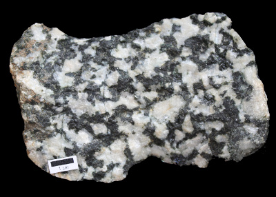

Diorite Library
===============

Diorite is a a grey to dark-grey intermediate intrusive igneous rock. Diorite library is a utility
and widget library for Nuvola Player project based on GLib, GIO and GTK.

*Photo by Michael C. Rygel via Wikimedia Commons, [CC BY-SA 3.0](http://creativecommons.org/licenses/by-sa/3.0/deed.en)*

Status: Early alpha
--------------------

  - No API & ABI stability
  - Dependencies are not frozen
  - No test case
  - No documentation
  - Not suitable for your project

Dependencies
------------

  - Python 2 or 3 to run ./waf
  - Python 3 to run ./testgen.py
  - glib-2.0 >= 2.38
  - ghread-2.0 >= 2.38
  - gio-2.0 >= 2.38
  - gtk+-3.0 >= 3.10

Build
-----

    $ ./waf configure
    $ ./waf build

Install
-------

    # ./waf install
    
Uninstall
---------

    # ./waf uninstall

Usage
-----

Because Diorite Library doesn't have any API nor ABI stability guarantee yet,
it uses 0.x version suffix in library name to make multiple versions co-installable:

  * pkg-config files: ``dioriteglib-0.x.pc`` and ``dioritegtk-0.x.pc``
  * header files: ``diorite-1.0/dioriteglib-0.x.h`` and ``diorite-1.0/dioritegtk-0.x.h``
  * VAPI files: ``dioriteglib-0.x.{deps,vapi}`` and ``dioritegtk-0.x.{deps,vapi}``
  * shared libraries: ``libdioriteglib-0.x.so`` and ``libdioritegtk-0.x.so``

You probably want to use ``pkg-config``:

    $ pkg-config --libs --cflags dioriteglib-0.1
    -I/usr/local/include/diorite-1.0 -I/usr/include/glib-2.0 \
    -I/usr/lib/x86_64-linux-gnu/glib-2.0/include \
    -L/usr/local/lib -ldioriteglib-0.1
    
    $ pkg-config --libs --cflags dioritegtk-0.1
    -I/usr/local/include/diorite-1.0 -I/usr/include/glib-2.0 \
    -I/usr/lib/x86_64-linux-gnu/glib-2.0/include \
    -L/usr/local/lib -ldioritegtk-0.1

Environment Variables
---------------------

Diorite recognizes several environment variables for debugging:

  * `DIORITE_SHOW_MENUBAR` - if `true` ApplicationWindow shows menubar. This is useful if you test
    menubar in other environments than Unity, because the menubar is not show by default.
 
  * `DIORITE_GUI_MODE` - set to `unity`, `gnome`, `xfce` or `default` to simulate look of
    a application window (menu bar, header bar, app menu, etc.) in different environment.
  
  * `DIORITE_LOG_MESSAGE_SERVER` - if `yes` IPC Message server communication will be logged
  
  * `DIORITE_LOGGER_FATAL_STRING` - abort program when message matching the fatal
    [string pattern](https://developer.gnome.org/glib/stable/glib-Glob-style-pattern-matching.html) is logged.
